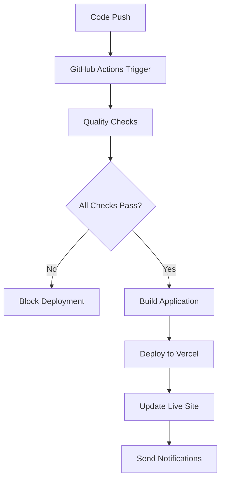

# Deployment Guide

Complete deployment workflow documentation for the AI Operations Lead landing page.

## 🌍 Live Environments

| Environment | Purpose | URL | Branch |
|-------------|---------|-----|---------|
| **Production** | Live customer-facing site | `https://ai-operations-lead.vercel.app` | `main` |
| **Preview** | Testing & review | Dynamic Vercel URLs | PR branches |
| **Development** | Local development | `http://localhost:3000` | Local |

## 🚀 Deployment Methods

### 1. Automatic Deployment (Recommended)

**Triggers**: Push to `main` branch

```bash
# Standard workflow
git checkout main
git pull origin main
git checkout -b feature/update-pricing
# Make your changes...
git add .
git commit -m "Update pricing section"
git push origin feature/update-pricing
# Create PR → Merge → Auto-deploy
```

**Process**:
1. Quality checks run automatically
2. Build verification
3. Security scan
4. Deploy to production (if all checks pass)
5. Vercel URL updated instantly

### 2. Manual Deployment

**Using Vercel CLI**:

```bash
# Deploy to production
npm run deploy

# Create preview deployment
npm run preview

# Deploy specific directory
vercel --prod --cwd ./dist
```

**Using Vercel Dashboard**:
1. Go to [Vercel Dashboard](https://vercel.com/dashboard)
2. Select your project
3. Click "Deploy" → "Deploy from Git"
4. Choose branch and deploy

### 3. Preview Deployments

**Automatic**: Every pull request gets a preview deployment

**Manual Preview**:
```bash
vercel
# Follow prompts for preview deployment
```

## 📊 Deployment Pipeline



### Pipeline Stages:

1. **Code Quality** (2-3 minutes)
   - ESLint checks
   - TypeScript compilation
   - Build verification

2. **Security Scan** (1-2 minutes)
   - Dependency audit
   - Vulnerability check

3. **Build & Deploy** (3-5 minutes)
   - Optimized production build
   - Static asset generation
   - Vercel deployment

4. **Verification** (1 minute)
   - Health checks
   - URL validation

**Total deployment time: ~7-11 minutes**

## ⚙️ Configuration Files

### `vercel.json` - Deployment Configuration

```json
{
  "buildCommand": "npm run build",
  "outputDirectory": ".next", 
  "framework": "nextjs",
  "regions": ["iad1", "sfo1"],
  "headers": [...],
  "redirects": [...] 
}
```

**Key Settings**:
- **Framework**: Next.js auto-detection
- **Regions**: US East (Virginia) + US West (San Francisco)
- **Security Headers**: XSS protection, frame options, HSTS
- **Caching**: Optimized for static assets

### `.github/workflows/ci.yml` - CI/CD Pipeline

**Workflow Jobs**:
1. `quality-check` - Code validation
2. `deploy` - Production deployment (main branch only)
3. `preview-deploy` - PR preview deployments
4. `security-check` - Vulnerability scanning

## 🔧 Environment Variables

### Required Secrets (GitHub):
```
VERCEL_TOKEN=your_vercel_api_token
VERCEL_ORG_ID=your_organization_id  
VERCEL_PROJECT_ID=your_project_id
```

### Environment Variables (Vercel):
```
NODE_ENV=production
NEXT_TELEMETRY_DISABLED=1
```

**Setting up in Vercel Dashboard**:
1. Go to Project Settings → Environment Variables
2. Add variables for Production/Preview/Development
3. Deploy to apply changes

## 📈 Monitoring & Logs

### GitHub Actions Logs
- **Location**: Repository → Actions tab
- **Retention**: 90 days
- **Access**: Full build and deployment logs

### Vercel Deployment Logs
- **Location**: Vercel Dashboard → Deployments
- **Real-time**: Live build logs during deployment
- **Function Logs**: Serverless function execution logs

### Analytics & Performance
- **Vercel Analytics**: Built-in visitor analytics
- **Core Web Vitals**: Performance metrics
- **Error Tracking**: Automatic error reporting

## 🚨 Troubleshooting Deployments

### Common Issues & Solutions

#### ❌ Build Fails
```bash
# Check locally first
npm run validate
npm run build

# Fix issues and redeploy
git add .
git commit -m "Fix build issues"
git push origin main
```

#### ❌ TypeScript Errors
```bash
# Run type checking
npm run type-check

# Common fixes:
# 1. Fix import paths
# 2. Add missing type declarations
# 3. Update component props
```

#### ❌ Vercel 500 Error
1. Check function logs in Vercel dashboard
2. Verify environment variables
3. Check for runtime errors in serverless functions

#### ❌ Slow Deployment
**Causes**:
- Large dependencies
- Complex build process
- Network issues

**Solutions**:
- Optimize bundle size
- Use build caching
- Check Vercel status page

### Emergency Rollback

**Using Vercel Dashboard**:
1. Go to Deployments tab
2. Find previous working deployment
3. Click "Promote to Production"

**Using CLI**:
```bash
vercel rollback [deployment-url]
```

## 🔐 Security & Best Practices

### Security Headers (Configured)
- `X-Content-Type-Options: nosniff`
- `X-Frame-Options: DENY`
- `X-XSS-Protection: 1; mode=block`
- `Strict-Transport-Security: max-age=31536000`

### Best Practices
- ✅ Never commit secrets to Git
- ✅ Use environment variables for configuration
- ✅ Test changes in preview deployments
- ✅ Monitor deployment status
- ✅ Keep dependencies updated

### Automated Security
- **Dependency scanning**: npm audit in CI
- **Vulnerability alerts**: GitHub Dependabot
- **HTTPS enforcement**: Vercel automatic HTTPS

## 📋 Pre-Deployment Checklist

Before deploying major changes:

- [ ] **Local testing**: `npm run dev` works correctly
- [ ] **Build verification**: `npm run build` succeeds
- [ ] **Code quality**: `npm run lint` passes
- [ ] **Type safety**: `npm run type-check` passes
- [ ] **Responsive design**: Test on mobile/tablet
- [ ] **Performance**: Check Core Web Vitals
- [ ] **Content review**: Verify all copy and images
- [ ] **Form testing**: Test contact form submission
- [ ] **SEO check**: Verify meta tags and structure

## 🎯 Performance Optimization

### Automatic Optimizations (Vercel)
- **Image optimization**: Next.js Image component
- **Code splitting**: Automatic bundle optimization
- **Edge caching**: Global CDN distribution
- **Compression**: Gzip/Brotli compression

### Manual Optimizations
- **Bundle analysis**: `npm run build` shows bundle sizes
- **Lazy loading**: Framer Motion components load on demand
- **Font optimization**: Google Fonts with display=swap

## 📞 Support & Maintenance

### Monitoring Schedule
- **Daily**: Check deployment status
- **Weekly**: Review analytics and performance
- **Monthly**: Update dependencies and security patches

### Maintenance Tasks
```bash
# Update dependencies
npm update

# Security audit
npm audit

# Performance check
npm run build && ls -la .next/static/

# Deploy maintenance
git add .
git commit -m "chore: update dependencies"
git push origin main
```

---

## 🎉 You're All Set!

Your deployment pipeline is now fully configured and ready for production use. The site will automatically deploy on every push to main, with quality gates ensuring only working code reaches production.

**Quick commands**:
- `npm run dev` - Local development
- `npm run validate` - Full quality check
- `npm run deploy` - Manual production deployment
- `npm run preview` - Manual preview deployment

Happy deploying! 🚀